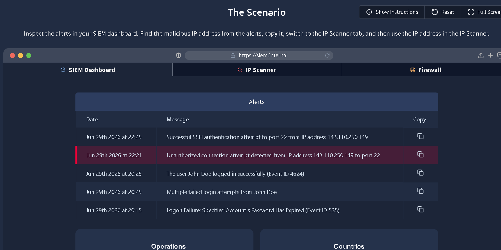
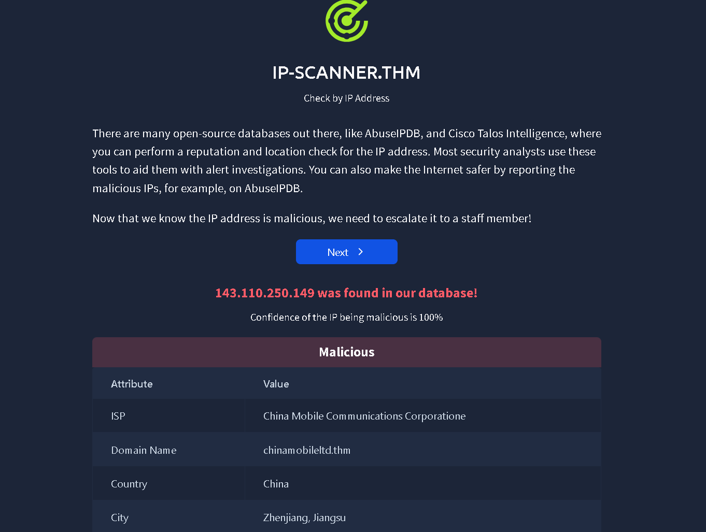
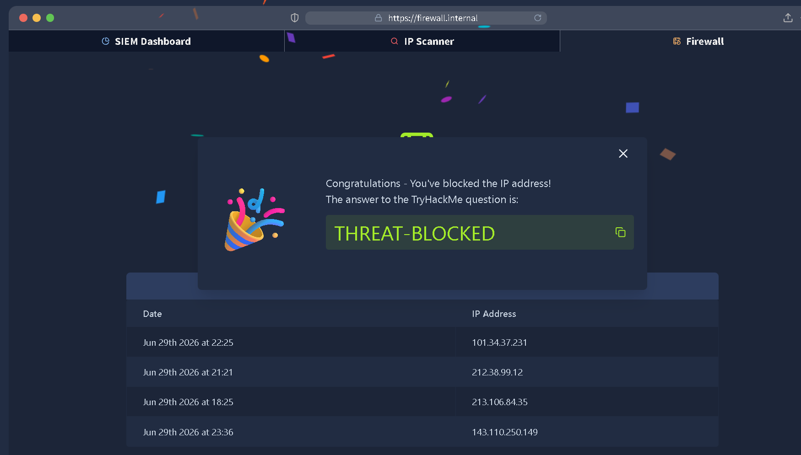
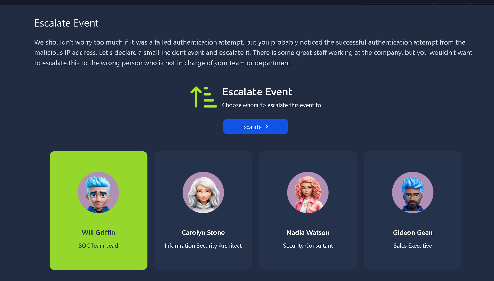

# TryHackMe – Defensive Security Intro

**Platform:** TryHackMe  
**Category:** Defensive Security  
**Difficulty:** Easy

---

# Scenario

This room introduced a simplified Security Operations Center (SOC) workflow. The objective was to investigate security alerts, determine whether suspicious activity represented a genuine threat, contain it, and escalate the incident appropriately.

---

# Investigation

The investigation began by reviewing alerts generated in the SIEM dashboard.

Among the logged events, IP address **143.110.250.149** immediately stood out because it appeared in multiple SSH-related alerts. The activity included an **unauthorized connection attempt** followed by a **successful SSH authentication** to port 22.

While isolated failed authentication attempts are common, a successful authentication immediately after suspicious activity increases the likelihood of unauthorized access. Based on this sequence, I selected the IP address for further investigation.

### SIEM Dashboard

*Figure 1: Multiple alerts involving IP address `143.110.250.149`, including a successful SSH authentication event.*

---

# Threat Intelligence Analysis

To determine whether the observed activity was malicious or a false positive, I investigated the IP address using the integrated IP Scanner.

The lookup classified the address as **Malicious** with a **100% confidence score**.

Additional intelligence returned by the scanner included:

| Indicator | Value |
|-----------|-------|
| IP Address | 143.110.250.149 |
| Confidence | 100% |
| ISP | China Mobile Communications Corporation |
| Domain | chinamobileltd.thm |
| Country | China |
| City | Zhenjiang, Jiangsu |

The threat intelligence aligned with the SIEM findings. Since both internal telemetry and external reputation data indicated malicious activity, I treated the IP as a confirmed indicator of compromise rather than continuing to monitor it.

### IP Reputation Lookup

*Figure 2: Threat intelligence confirmed the IP address as malicious with a confidence score of 100%.*

---

# Containment

After validating the indicator, I blocked **143.110.250.149** using the firewall management interface.

Blocking the address immediately prevented further communication from the identified source while allowing the investigation to continue. Although blocking an IP alone does not guarantee that an attacker has been removed from the environment, it reduces the opportunity for additional malicious activity during incident response.

### Firewall Rule

*Figure 3: The malicious IP address added to the firewall block list.*

---

# Escalation

The incident was escalated to the **SOC Team Lead** after containment.

The decision to escalate was based on the presence of a **successful SSH authentication event**, not simply because the IP address had a malicious reputation.

Even though the firewall rule prevented future connections, the successful authentication raised additional questions that required further investigation, including:

- Whether valid credentials had been compromised.
- Whether persistence mechanisms had been established.
- Whether additional hosts had communicated with the attacker.
- Whether any post-authentication activity had occurred before containment.

Escalating the incident ensured these questions could be investigated before the event was considered resolved.

### Escalation

*Figure 4: Escalating the incident to the SOC Team Lead for continued investigation.*

---

# Lab Completion

After identifying the malicious indicator, validating it through threat intelligence, blocking the IP address, and escalating the incident, the room objectives were successfully completed.

### Challenge Completion

*Figure 5: Successful completion of the Defensive Security Intro room.*

---

# Key Takeaways

- Correlating multiple alerts provides better context than evaluating individual events in isolation.
- Threat intelligence should be used to validate suspicious indicators before taking containment actions.
- Containment reduces immediate risk, but successful authentication events should always trigger additional investigation.
- Escalation is an important part of the incident response process because blocking malicious activity does not confirm that an environment is free from compromise.

---

# Tools Used

- TryHackMe AttackBox
- Simulated SIEM Dashboard
- Integrated IP Scanner
- Firewall Management Interface

---

# Final Thoughts

This room demonstrated a simplified incident response workflow from detection to escalation. Rather than treating alerts independently, I correlated SIEM events with threat intelligence to determine the appropriate response. Although designed as an introductory exercise, the investigation followed the same sequence commonly used in SOC environments: identify suspicious activity, validate the indicator, contain the threat, and escalate when additional investigation is required.
